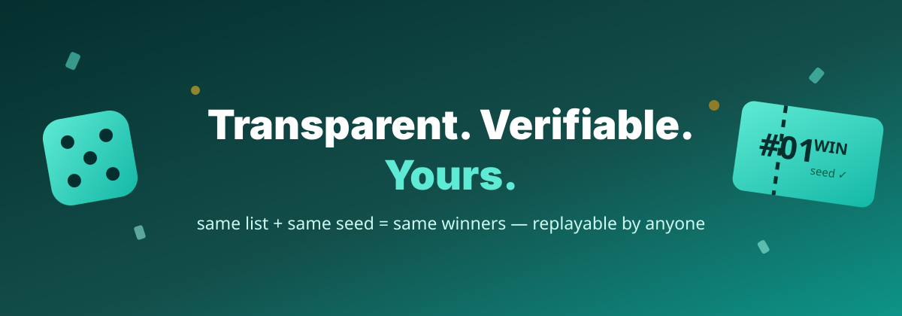

<div align="center">



# 🎲 RaffleMint

**Transparent, verifiable giveaways — deterministic seeded raffles anyone can replay.**

[](https://github.com/chr-z/rafflemint/actions/workflows/ci.yml)
[](LICENSE)
[](manifest.json)
[]()
[]()

🔗 **Live demo:** **[chr-z.github.io/rafflemint](https://chr-z.github.io/rafflemint/)** · no signup, free forever

</div>

---

Giveaway rigs get accused every day. RaffleMint removes the doubt: paste your
participant list, pick a **public seed**, and draw winners with a **deterministic
algorithm**. The same list + the same seed always produces the exact same winners —
so anyone in your audience can replay the draw and verify it themselves.
No accounts. No server. No "trust me bro".

## ✨ Features

- 🎲 **Deterministic seeded draws** — mulberry32 PRNG + FNV-1a seed hashing; zero crypto deps
- 🔁 **Publicly replayable** — publish list + seed, and any participant gets identical winners
- 🏆 **Multiple winners, no repeats** — Fisher–Yates shuffle with clamped count
- 🧾 **Copyable proof** — one click copies a receipt (prize, seed, pool size, winners) for your post
- 👥 **Flexible lists** — one-per-line, comma or semicolon separated, auto-deduplicated
- 💱 **Multi-currency prizes** — USD, EUR, GBP, BRL, JPY via `Intl.NumberFormat`; accepts `1,234.56` and `1.234,56`
- 🌍 **Global-first i18n** — English & Português (BR), header language selector
- 🔗 **State-in-URL sharing** — the whole raffle is encoded in a `?d=…` link that auto-draws on open
- 💾 **Auto-save + JSON export/import** — drafts persist in `localStorage`
- ⚡ **PWA** — installable, offline-first service worker
- ♿ **Accessible** — semantic forms, labels, focus states, live result region

## 🚀 Run a verifiable giveaway in 30 seconds

1. Open the [demo](https://chr-z.github.io/rafflemint/)
2. Paste participants → name your prize → type a public seed (e.g. `live-2026-08-23`)
3. **Draw winners** → hit **Copy proof** → paste the receipt in your stream/post

Anyone can reopen the share link and confirm the same winners. That's the whole trick.

## 💰 Pricing

| | Free | Pro *(planned)* |
|---|---|---|
| Deterministic seeded raffles | ✅ | ✅ |
| Public proof / replay | ✅ | ✅ |
| Participants per raffle | unlimited | unlimited |
| Branded raffle pages | — | ✅ |
| Weighted entries & multiple prizes | — | ✅ |
| Price | **$0** | $4/mo |

## 🗺️ Roadmap

- [ ] Weighted entries (loyalty multipliers) while staying replayable
- [ ] Multiple prize tiers per draw
- [ ] Embeddable widget & OBS overlay
- [ ] Draw history export (CSV)
- [ ] More languages (ES first)

## 🧑‍💻 Development

```bash
npm test          # determinism, clamping, odds, currency parsing, share round-trip
npm run serve     # local dev server at http://localhost:8080
```

Zero runtime dependencies. Pure ES modules + `Intl` + a 40-line PRNG.
Node ≥ 18 for tests.

## Built by [@chr-z](https://github.com/chr-z)

Part of a fleet of free, no-backend micro-SaaS tools.
If it's useful, a ⭐ helps more creators find it.

## License

[MIT](LICENSE)
